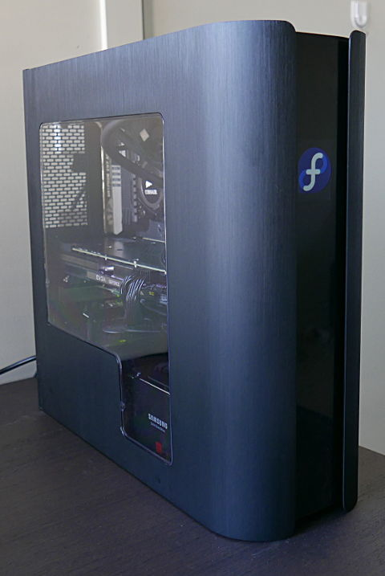

One of the nice things about the Pandora and other BitFenix cases is the programmable logo on the front; they have a Windows application for changing the logo, but nothing for Linux. In fact, there is no information whatsoever on getting the logo changed in Linux at all anywhere on the internet. Thankfully, BitFenix uploaded the source code to their windows application on their site, so it made it easy for me to get it working in Linux.

This brings up some interesting possibilities when combined with scripts; one could change logo based on the weather, or let you know if you have unread mail, etc.

This is the end result with the Fedora logo:




### Download & installation

The [original](https://bitfenix.com/global/en/products/chassis/pandora#support) source code is liberally licensed, so I took the code and cut all the cruft, and reduced 18MB of code to 36KB, having just what is needed to update the logo. 

So [download the modified source code here](bitfenix-icon-src.tar.gz) and set it up:
```
tar xvzf bitfenix-icon-src.tar.gz
cd bitfenix-icon/
dnf groupinstall "Development Tools"
dnf install hidapi-devel libpng-devel turbojpeg-devel libjpeg-turbo-devel
g++ -w -lhidapi-hidraw -ljpeg  -lpng  jpegdecode.cpp  pngdecode.cpp hidtest.cpp -fpermissive -o bitfenix-icon
```

This should leave you with the bitfenix-icon binary.


### Usage

Like the Windows counterpart, this doesn't have a GUI; just create a JPEG or PNG image that has the resolution of **240x320**, and give the binary the path to the image, running it as root:

```
sudo ./bitfenix-icon /path/to/image.png
```

and that's it, after some brief blackness, the display should show your new image.


### Case review

If you haven't purchased this case yet, and think changing the logo is amazingly cool; you should know that the logo _only_ looks good when seeing it at eye level. Seeing the logo from above or below makes it discolored and the square display bright and visible (ruining the illusion of a black background blending with the case).

However, it's still remarkable seeing such a thin MicroATX case fitting in my 64GB of RAM, a full-sized graphics card, full sized power supply, 2 separate SSDs, and 2 separate HDDs (I use RAID1), plus a 240mm AIO water cooler. It's undoubtably a very good looking case, and it's thin profile looks awesome and actually saved a few centimeters in my crowded table. The dust filters are nice, and the brush metal side panels look great.

Yet, it was very difficult working with this case. I would _not_ recommend this case if you do not have a lot of experience building PCs, there is extremely little room to work with, and your cable management needs to be perfect. If you are used to stuffing a bunch of cables on the hidden side of the case Mr. Bean style, putting the side panel until it fits like me, this case would be challenging to work with. By far the most annoying thing about the case is the push pin side panels; there are no screws and you have to snap the side panels into place, which is very frustrating for a thin case as the slightest cable buldge would make it impossible to close the case.

Also, a note that many reviewers forget to mention is that you can't just have _any_ GPU you want in it; it's rather sensitive about the GPU width, which is often undocumented in many graphics card specs. In addition, the PCI express power cables can increase the actual space taken as well. Luckily, my eVGA GeForce 980Ti with the GPU power supply just fit by 0mm. Your Air CPU cooler selection would also be greatly limited, but 120mm or 240mm liquid AIO coolers work well. I would also recommend a relatively short PSU if possible, which would give you valuable empty space in the case.


