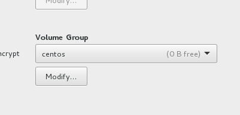
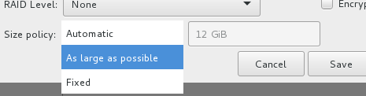
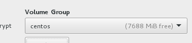

If you're running RHEL or CentOS 6, see [this guide](/articles/el6-standard-installation/) instead.

### Before the install

- Set up an iLO/iDRAC/IPMI cable & IP

- Note that if you are installing CentOS/RHEL on an HP server with software RAID (eg. Bxxxi RAID controller), and you want to avoid the proprietary RAID drivers, go to the BIOS options -> System Options -> SATA controler options -> Enable SATA AHCI support (this is [suggested by Red Hat](https://access.redhat.com/site/articles/118133)). If you don't do this, the installation will proceed as usual, but the BIOS will not boot into GRUB (because it will try booting from a non-existent HP RAID volume)

- Make sure your servers come with flash-backed or battery backed write cache. This can lead to a _huge_ increase in performance.

- Set up the partitions depending upon the scenario. Do NOT use ridiculous names for logical volumes or mount points like Vol00, use something that makes sense. 
- Keep around 5-15 GB of space unused in your volume group. This is important for LVM snapshots, as without some empty space in your VG, you can't take snapshots (the amount depends on the level of changes you expect during a snapshot life/backup). This is less straight-forward to do in EL7 than EL6, because the default policy is to make the PV/VG size only as large as the total LVs, which is not what we want. Notice the 0 bytes free in the Volume Group in the screen below? Click on Modify:

Then change the policy to "As large as possible":

This is better:

  
- If you have software RAID, and are booting via UEFI instead of a legacy boot, add a /boot/efi2 partition as well (EFI or FAT) in addition to the mandatory /boot/efi partition. Then, after the installation, copy whatever is in /boot/efi to /boot/efi2, and then use the BIOS to add what's in /boot/efi2/redhat/*.efi to the boot order as well.

	

### RHEL subscription

If this is RHEL, assuming you purchased a subscription, you should register the system. If your account is new or does not have a lot of subscription, the auto-attach should be fine:
```
subscription-manager register --username someone@somewhere.com --servicelevel=None|Standard|Premium --auto-attach
```
(if you purchased EUS, you can set a specific release with --release)
That should be it, and you should be done.


But on the other hand, if you had your account for a while, you will most likely want to choose which subscription from your account you'd want to attach to this server, so do a simple registration without an auto-attach:
```
subscription-manager register
```
Then see the available subscriptions and guess which one's yours (it crazily multiplies the purchased subsciptions by 2, all because it doesn't support floating point numbers for virtual subscriptions (which would otherwise be 0.5 subscriptions)):
```
subscription-manager  list --available
```
Note the Pool ID of the one you want, and attach to it using:
```
subscription-manager attach --pool=abc1234935
```

It may have automatically set up some unnecessary yum repositories, find out what's enabled with:
```
subscription-manager repos --list | grep -B 3  '^Enabled:   1'
```
And disable what you don't need with:
```
subscription-manager repos --disable rhel-server-dts-7-rpms --disable rhel-server-dts2-7-rpms
```
Or just select what you need with (the * needs a new subscription-manager, yum update it):
```
subscription-manager repos --list
subscription-manager repos --disable='*' --enable rhel-what-you-need --enable rhel-more-stuff
```


If you need to use a proxy to register, use:
```
subscription-manager config --server.proxy_hostname=1.2.3.4 --server.proxy_port=8080 --server.proxy_user=yourUserIfNeeded --server.proxy_password=yourPass
```
The settings above get saved to the rhsm.conf file. To remove the proxy after setting it; just set the proxy_hostname with the same command to an empty string.

If you've used the auto-attach and discovered that it attached the wrong subscription, type in:
```
subscription-manager  list --consumed
```
and remove that subscription using the serial (not the pool ID) it mentions:
```
subscription-manager remove --serial=123456789
```

### After the installation

- (Optional, if you need it) You might have ended up with a complex name for your interfaces. If you want to revert to a more familiar ethX convention, edit **/etc/default/grub** and append `net.ifnames=0 biosdevname=0` to the `GRUB_CMDLINE_LINUX` variable. Then generate the grub config with:
Normal BIOS: `grub2-mkconfig -o /boot/grub2/grub.cfg`
UEFI: `grub2-mkconfig -o /boot/efi/EFI/redhat/grub.cfg`
You'd then need to rename the interfaces and `DEVICE=` lines in /etc/sysconfig/network-scripts/

- If you have a software RAID set up during the installation, and are using:
	- Legacy booting: Install grub2 on the other drives with `grub2-install /dev/sdx`
	- UEFI booting: You should have created a FAT /boot/efi2 partition during the install. Copy everything in /boot/efi into it, and make your BIOS add this as the secondary boot option.

- Make sure your timezone is correct (`date`). If not, set it with `timedatectl set-timezone Asia/Dubai`

- Unless it is going to be used by someone who needs to change the IP address easily; disable NetworkManager and configure the network by hand:
`systemctl stop NetworkManager`
`systemctl disable NetworkManager`
Edit **/etc/sysconfig/network-scripts/ifcfg-eth0** and add `DEVICE=eth0` along with the usual lines, plus `ONBOOT=yes`. Set the hostname:
`hostnamectl set-hostname themachine.mydomain.com`
and add the DNS servers to **/etc/resolv.conf**, and the NTP servers if any to **/etc/chrony.conf**

- Clean up your root directory: `cd /root && mkdir -p apps backups bin temp scripts && mv anaconda-ks.cfg temp`

- `yum install screen telnet deltarpm net-tools lsof bash-completion vim iptraf bind-utils wget`

- Add this to the end of **/etc/screenrc** to enable scrolling in screen:
`termcapinfo xterm* ti@:te@`
You should use screen whenever you run a long running foreground process, like a yum update, because if you lose your SSH session (laptop battery dies or network disconnects), the process gets killed, and a half-update can easily corrupt your system state. The basics of screen is easy, just run 'screen', and then use it normally. To detach manually, press in Control+a, and then press d. To rejoin, type screen -r. It will take a bit more explaining, perhaps in a different article.

- Do a `yum -y update` in screen

- If your app doesn't support SELinux, disable it by editing **/etc/selinux/config**, but if this is a webserver or a public facing server, it's HIGHLY recommend you learn SELinux and keep it enforcing.


- Install the [nload](http://dl.fedoraproject.org/pub/epel/7/x86_64/repoview/nload.html) RPM, and create a file `/root/bin/bandwidth` with the contents `nload -u K -U K eth0`, and chmod +x it.

- If this is a web server or a server that needs to be highly secured, edit the /tmp mount point to add these options: `nosuid,noexec,nodev,noatime`. It would also make sense to public-writable mount points, if any, like /var/www. 

- Add noatime to the other mount points including root (no need for /boot though). You can consider disabling fsck (0 0 at the end) for non root mount points; as otherwise you may not be able to SSH to a server if a non-root filesystem got corrupt, since it will prompt for admin intervention in the physical console. On the other hand, the filesystem could spend years without being checked, so you may want to remember doing it during maintenance activities.

- Disable unnecessary services that start up. See the startup services with `systemctl list-unit-files --type=service | grep enabled` and disable them, for example (edit according to your needs):
`for i in abrt-ccpp.service abrt-oops.service abrt-vmcore.service abrt-xorg.service abrtd.service dmraid-activation.service hypervkvpd.service hypervvssd.service iscsi.service kdump.service mdmonitor.service multipathd.service postfix.service smartd.service ; do systemctl stop $i; systemctl disable $i; done`

- It's good to have dnsmasq as a super-quick local caching DNS proxy. Add a file called **/etc/dnsmasq.d/local.conf** containing:
`cache-size=9000`
`listen-address=127.0.0.1`
`bind-interfaces`
and then `systemctl start dnsmasq ; systemctl enable dnsmasq` and add `nameserver 127.0.0.1` to the top of **/etc/resolv.conf**

- Set the FQDN & short hostname in /etc/hosts with the IP address

- To speed up SSH logins, edit **/etc/ssh/sshd_config** and change `GSSAPIAuthentication yes` to `no`, and add `UseDNS no`

- Don't forget to configure iptables to allow your needed ports, or better yet use [FireHOL](/articles/easy-secure-firewalls-with-firehol/)

- If this will be a public server, you shouldn't have your SSH daemon listen on port 22, choose a random port instead and set that in /etc/ssh/sshd_config. Some apps like Zimbra can mess up unless SSH listens on 22, so you have have SSH listen on multiple ports just by multiple Port lines. If you have SELinux enabled, make it aware of your new port with `semanage port -a -t ssh_port_t -p tcp 1234`. At the risk of getting locked out, you may optionally stop it allowing port 22 if you are really sure: `semanage port -d -t ssh_port_t -p tcp 22`

- Set up [command logging](/articles/command-logging/)

- rsyslog by default will limit the logs from a daemon if it logs too much, but that can easily lead to lost log entries (note that this is different from preventing duplicate log lines, it actually stops logging anything from that daemon for some time). You can want to disable that by creating a file called **/etc/rsyslog.d/disable_ratelimiting.conf** with the following contents:
```
$SystemLogRateLimitInterval 0
$SystemLogRateLimitBurst 0
$imjournalRatelimitInterval 0
$imjournalRatelimitBurst 0
```

- If it's a production machine, edit the /root/.bashrc to make the prompt red so that you minimize making the all-too-common mistake of entering a command on the wrong terminal:
`export PS1="[\u@\[\e[1;31m\]\h\[\e[0m\] \W]\\$ "`
Make non-prod servers green:
`export PS1="[\u@\[\e[1;32m\]\h\[\e[0m\] \W]\\$ "`
or blue if it's development:
`export PS1="[\u@\[\e[1;34m\]\h\[\e[0m\] \W]\\$ "`


- Add this to .bashrc to prevent accidental reboots by giving you a chance to change your mind:
```
alias reboot='echo "Rebooting `hostname` in 5 secs. Press Ctrl+C to cancel";sleep 5 && reboot'
alias poweroff='echo "Shutting down `hostname` in 5 secs. Press Ctrl+C to cancel";sleep 5 && poweroff'
```

- (Optional) Install & set up tuned:
```
yum install tuned
systemctl enable tuned
tuned-adm active   # Find out current profile
tuned-adm list   # List available profiles
tuned-adm profile throughput-performance   # Set a profile
```

- Install the server vendor tools (but NOT drivers, if possible); eg. hp-health and hpssacli for HP from:
[http://downloads.linux.hp.com/SDR/repo/mcp/EnterpriseEnterpriseServer/7/x86_64/current/](http://downloads.linux.hp.com/SDR/repo/mcp/EnterpriseEnterpriseServer/7/x86_64/current/)
For Dell, use the instructions:
[http://linux.dell.com/repo/hardware/latest/](http://linux.dell.com/repo/hardware/latest/)
Install OpenIPMI as well, start it up (or reboot), and then run:
`srvadmin-services.sh start`
and check `srvadmin-services.sh status` to make sure the services are running. You can check the temperature with `/opt/dell/srvadmin/bin/omreport chassis temps`. Add "srvadmin-services.sh start &" to /etc/rc.local if you can't find a cleaner way.

- iptraf is really useful when trying to figure out what's taking up the bandwidth, but it wastes a lot of bandwidth trying to show the byte usage of the SSH session (which causes it to update, and use more SSH traffic).
Ignoring SSH is quite tricky unless you know how; the key is that by default applying an empty filter will make it show nothing; so you need to have an explicit rule to show all traffic in the end :
Go to Filters -> IP -> Make sure there aren't any filters already in Edit filter.
Define a new filter-> Ignore SSH.
Press A to add to list. Make the IP address & widcard mask 0.0.0.0 on both destination & source. Source port is 0 to 0, destination port is 22 (or 2251) to 0. Then make sure you put a 'Y' in All IP and TCP. Then put 'E' in Include/Exclude. Enter to accept.
Press A to add to list again. Make everything 0.0.0.0 or 'Y', and make sure it's the default 'I' for include.
You then need to apply the filter.
If you ever edit the filter, it won't apply automatically. You have to detch and apply the filter again.

- Set up bonding & multipathing as well.


