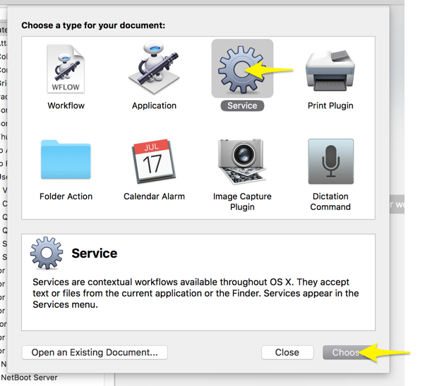
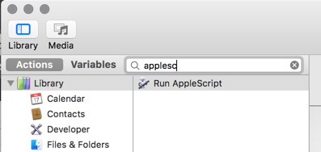
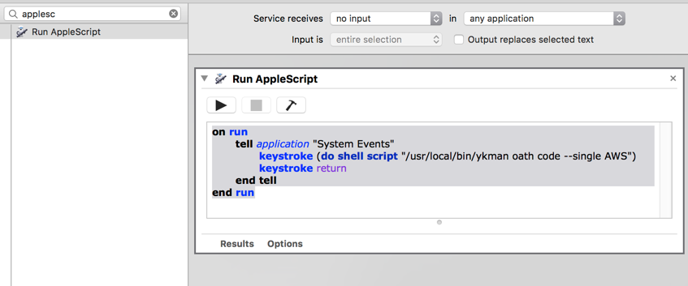
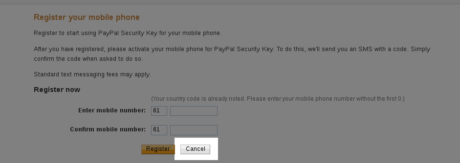
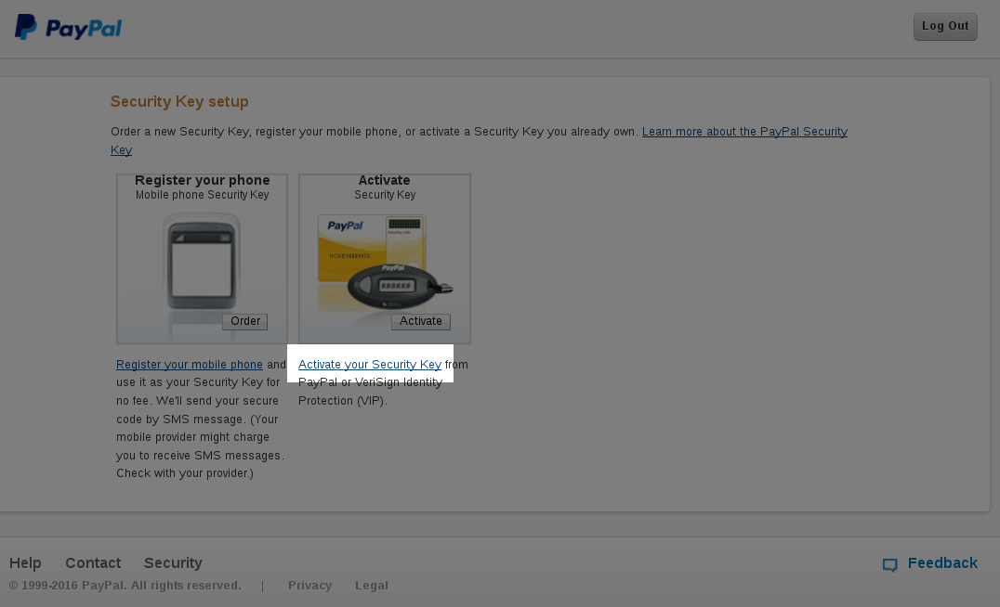
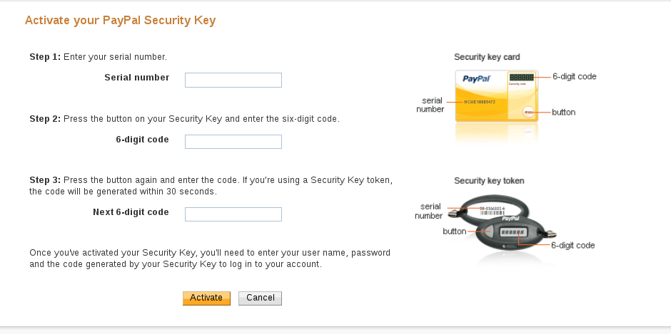
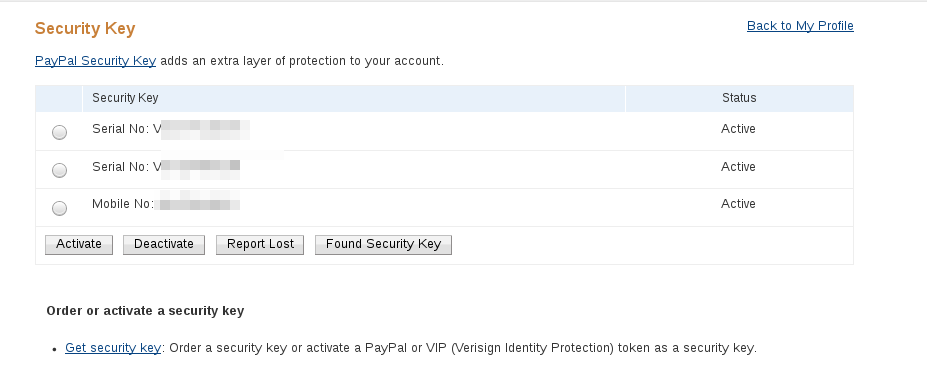
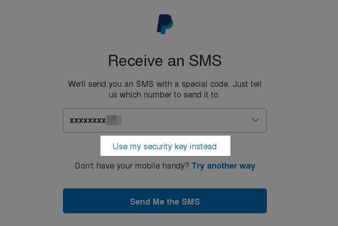
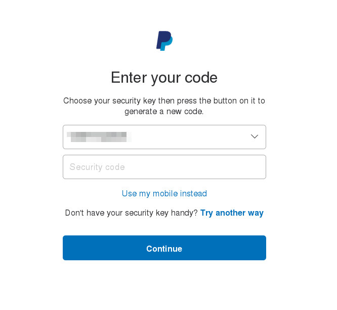

Before you get too excited, this isn't what you think it is; you can't just press the button on the Yubikey and have it enter the 6 digit token, because AWS and Paypal uses TOTP (Time-Based OTP), and the Yubikey does not have a battery to maintain an internal clock. However, how the Yubikey can be helpful is in having a secure portable write-only store of the TOTP secret, which can be used by the open source Yubikey Authenticator application installed on your desktop to generate a token.  You can get pretty close to nirvana by using Yubikey's desktop app combined with a script to type in the 6 digit token after pressing a keyboard shortcut. 

<video preload="auto" autoplay="autoplay" loop="loop" style="width: 640px; height: 360px;">
    <source src="aws-yubikey.webm" type="video/webm"></source>
</video>

## Getting a token with a keyboard shortcut

### Mac

First, to make your life easier, install the Yubico Authenticator GUI:
[https://www.yubico.com/support/knowledge-base/categories/articles/yubico-authenticator-download/](https://www.yubico.com/support/knowledge-base/categories/articles/yubico-authenticator-download/)

Configure two factor authentication in whatever application you use (eg. for AWS, delete your old MFA virtual device, and create a new MFA virtual device, which would give you a QR code you can scan).

Ensure your Mac's clock is accurate, and then use the QR Code scanner in the Yubico Authenticator to scan the AWS (or whatever) QR code that is displayed anywhere on the screen by going to File -> Scan QR Code. You may want to also add the QR code to your phone in whatever application you normally use. Use either the Yubico application or your phone to generate 6-digit code to set up two factor authentication as needed; both your phone and the Yubico Authenticator should be showing the same 6-digit codes.

Then download the Yubikey Manager command line interface::
```
brew install yubikey-personalization ykman
# Test it out:
ykman oath list
```

It should show you a list of TOTP accounts configured in your yubikey. You can get a 6 digit code with something like 
```
ykman oath code --single AWS # replace AWS with some unique string in "ykman oath list"
```

We're almost there, since we can now generate a 6 digit code programmatically, all we need to do is use the OSX Automator to "type" that code when we press a keyboard shortcut.

Start "Automater", and create a new Service:



Search for AppleScript:



Drag and drop the "Run AppleScript" text to the right side. In the top, select Service receives "no input". Then type in:
```
on run
  tell application "System Events"
    keystroke (do shell script "/usr/local/bin/ykman oath code --single AWS")
    keystroke return
  end tell
end run
```

It should look something like this:



You can test it if you wish with the play icon (it should enter a 6 digit code).

Save the workflow (File -> Save) with some name you can remember, then go to System Preferences -> Keyboard -> Shortcuts -> Services, look for your new service, and set a shortcut for it that does not conflict with an existing shortcut.

Now, when you are prompted for an MFA token, just make sure your yubikey is plugged in, and press the shortcut.


### Linux

- Having an accurate clock is important for TOTP to work, so do have something like NTP/chrony running

- Install the Yubico Authenticator App:
Fedora: `sudo dnf install yubioath-desktop`
Ubuntu: `apt-add-repository ppa:yubico/stable && apt update && apt install yubioath-desktop`

- Make sure you have the pcscd service running (default in Fedora)

- Insert your Yubikey to a USB slot

- Start up the Yubico Authenticator (`yubioath gui`), and click on File -> Add

- Clicking on "Scan a QR code" would take a screenshot and look for a QR code on your screen. To generate a QR code for Paypal, see the section below ("Using Yubikey with PayPal"). If you use [FreeOTP](https://play.google.com/store/apps/details?id=org.fedorahosted.freeotp&hl=en), you can export your existing two factor setup by [backing it up](/articles/two-factor-auth-android-backup/) unencrypted, and then exporting it to either a [QR code](https://github.com/viljoviitanen/freeotp-export), or just get the [secret key](https://github.com/philipsharp/FreeOTPDecoder) which you can enter in Yubico

- Keep the rest of the settings as the default, and press OK. Test it out by logging to a service and trying out the two factor auth.

- Though double clicking and pasting the 6-digit token at this stage is easier than looking up the app on your phone and then memorizing/typing the 6 digit token, we can make it even more streamlined by associating a keyboard shortcut to type the code automatically. To see how this can be achieved, plug in your Yubikey, and type `yubioath show`, you'll see that shows you the tokens for each service:
```bash
[rizvir@main ~]$ yubioath
AWS rizvir:rizvir@612345678912      582045
AWS-work                            297593
SSH-bastion                         903845
```

We can use this to have a simple script that uses 'xte' to type the token & press enter. Install some dependencies:
```
dnf install xautomation zenity  #  or apt-get install on debian/ubuntu
```

and then save this script somewhere, say as **yubiauth-token.sh** :

```bash
#!/bin/bash

SERVICE="$1"

function show_error() {
    if command -v zenity >/dev/null 2>&1; then
        zenity --warning --text "$1"
    else
        echo "$1"
    fi
    exit 2
}

if [ -z "$SERVICE" ]; then
    show_error "Expected some service name after command; see the first column of the yubioath output"
    exit 2
fi

tokens=$(yubioath show)
if [ $? != 0 ]; then
    show_error "yubioath did not work, is the Yubikey plugged in?"
fi

token=$(echo "$tokens" | grep "$SERVICE" | awk '{print $NF}')
if [ $? != 0 ]; then
    show_error "Nothing matching $SERVICE on the yubioath output"
elif ! [[ $token =~ ^[0-9]{6}$ ]]; then
    show_error "Did not get a 6 digit token. Perhaps $SERVICE matches more than 1 entry?"
fi

xte "str $token" "key Return"
```

Make the script executable (`chmod +x yubiauth-token.sh`). To test the script, note down the service you want to generate the token for by selecting a name from the output of `yubioath`, then run the script like:
```
./yubiauth-token.sh "SomeService"
```

it should type a 6 digit token (and give you a command not found):
```
[rizvir@main scripts]$ ./yubiauth-token.sh "AWS rizvir:rizvir@612345678912"
22[xrx@main scripts]$ 223730
bash: 223730: command not found...
[rizvir@main scripts]$
```

This means that it's working. You then just need to create a keyboard shortcut to run the script when you press a certain key combination.


### Using YubiKey with PayPal

Now though PayPal doesn't officially support generic TOTP (asking users to instead use Symantec's "VIP Access client), someone called [cyrozap](https://www.cyrozap.com/) reverse engineered the VIP access protocol, and wrote an absolutely wonderful [python app](https://github.com/cyrozap/python-vipaccess) to allow you to generate a QR code allowing one to pretend you are using Symantec's client, and are instead

Assuming you have your Linux development packages installed, it's easy getting it to work. Just install 'pip' (Fedora: `dnf install python-pip`) and then do a `pip install python-vipaccess`. Assuming there are no errors, you should be able to then run `vipaccess` without any arguments. This generates a QR code/secret key, which you can scan/enter with the Yubico Authenticator. It will appear in your Yubico Authenticator OTP list as "VIP Access". You then just need to link this to PayPal.

Head over to PayPal, go to your Profile (click on the gear icon near the top right), and then on the Security tab. Click on Security Key, and then "Get Security Key". It will prompt you for your phone number; don't enter it and instead click on Cancel:



It will then give you an option of activating your "security key", click on that option:



It will ask you for some information:



Your freshly scanned entry in the Yubico Authenticator should have a serial number mentioned for your "VIP Access" token which would look like "VSST1234...", type that as the Serial Number. Then enter the 6-digit code, and repeat it again after around 30 seconds when the token changes. After you click on Activate, it should start working. 

Note that you can have multiple two factor options in PayPal:



so repeat these steps again to enter your mobile number in case your Yubikey is lost.

When you next log in, it will initially prompt you to confirm sending an SMS, though you can chose to log in via a "security token" instead:



which will give you a drop down of the serial numbers, where you can use the Yubico Authenticator token to log in:



