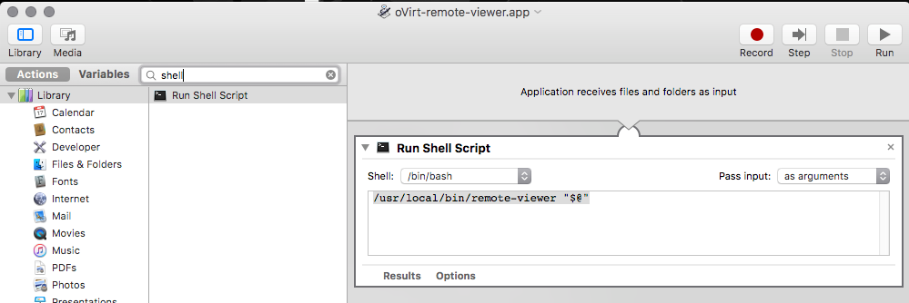

I normally prefer using Linux on my workstation, but had recently been given a Mac at work. This is just a quick article on the steps needed to get the Console button working on a Mac. Initial googling pointed to some mailing lists suggesting this was not possible when using the SPICE protocol, however that's not true, it's perfectly possible thanks to some work by [Jeffrey Wildman](https://github.com/jeffreywildman).

The end result would be immediately getting the GUI console when you click on the Console button in oVirt. This assumes that you have a working oVirt setup already.

### Install remote-viewer

First install Brew if you haven't already, and install the virt-viewer from [jeffreywildman](https://github.com/jeffreywildman/homebrew-virt-manager):

```
brew tap jeffreywildman/homebrew-virt-manager
brew install virt-viewer
```

This will take a long time. After it's done, you should be able to call "remote-viewer" on a terminal. So attempt launching the Console in oVirt, save the console.vv file somewhere, and then launch a terminal to run:
```
remote-viewer /path/to/console.vv
```

If this works, you're almost there. Note that it's normal for the file to get automatically deleted by remote-viewer once it uses it.


### Associating .vv files with remote-viewer

This turned out to be surprisingly non-intuitive. Apparently there is now way to easily open a file on a Mac with a non-"application" binary or bash script.

But there is a workaround mentioned by [Daniel Beck](https://superuser.com/questions/239231/osx-open-with-bash-script). So just:

- Launch Automator, and click on a New project
- Use the Type "Application"
- Search for "shell" on the left hand side, and drag the "Run shell script" entry to the right
- Use the following:
```
/usr/local/bin/remote-viewer "$@"
```




- Save this as say ~/Applications/oVirt-Console.app

- Now, the security policy of a Mac won't let you run this app made by an "untrusted developer", so in Finder, locate the .vv file, and then hold down the Control key. With the Control key pressed, click on the .vv file, and then right click, open with, look for the .app file you just made, and check the "Always Open With" checkbox in the bottom of the dialog. This took a couple of tries for it to work for me, so also try launching the file with the control key pressed, and selecting your .app file.

- Finally, in Chrome, after clicking on the Console button in oVirt, keep the downloaded file somewhere, and then click on the small downwards arrow on the list of downloads on the bottom, and select "Always open files of this type". 

After this, from now on, it should launch remote-viewer immediately after clicking on the console button.


	

