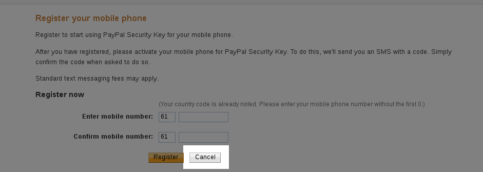
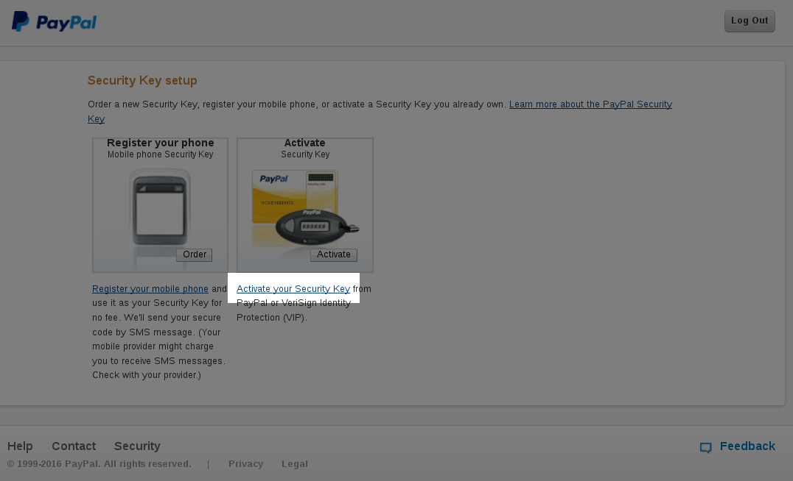
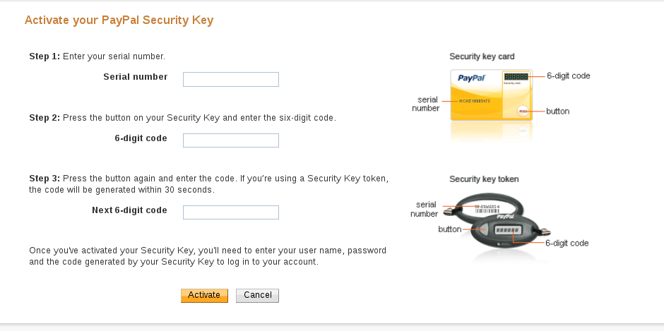
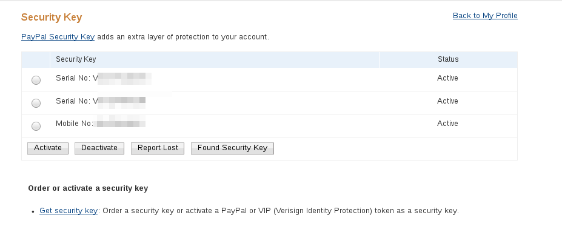
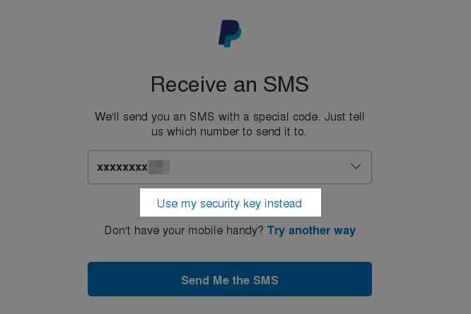
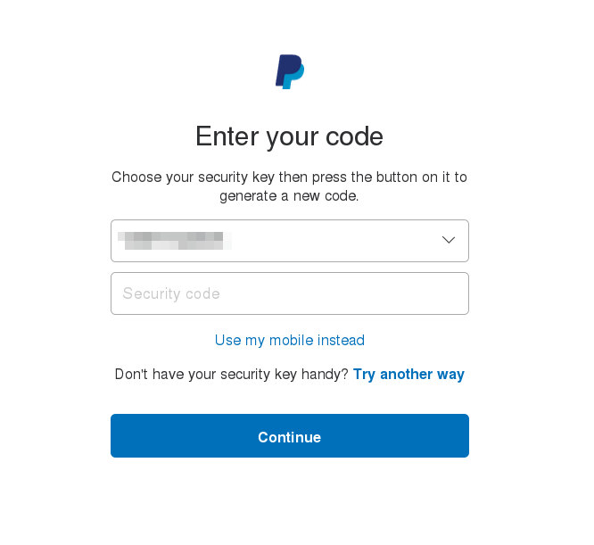

Before anything, if you aren't worried about using a closed source possibly cloud-enabled app to handle your two factor auth, you can use [Authy](https://www.authy.com) instead of FreeOTP/Google Authenticator which would save you a lot of trouble by keeping your tokens on their servers, but in my case, I much preferred to use an offline and open source app to handle by two factor authentication instead

### Start using FreeOTP

Google Authenticator, as of writing, does not let you backup it's database unless you have root access to your phone. In any case, even if you have root, it's a bother rooting a new phone to just recover the backup.

This is a method of backing up your two factor app **without root access**. The main change you need to do is start using the open source [FreeOTP](https://play.google.com/store/apps/details?id=org.fedorahosted.freeotp&hl=en) Android app by Red Hat instead of Google Authenticator. It works the same way (TOTP/HOTP), and is completely compatible with whatever works with Google Authenticator; you just have to start scanning your QR codes again in FreeOTP and start using that instead. Since Google Authenticator is now closed source, you should feel better by using an open source app instead. FreeOTP supports icons too, though unfortunately you will have to manually search for and download the icons to your phone first (I presume they did this to avoid requiring the scary Internet Access grant)

### Backing up FreeOTP

This involves backing up via USB/ADB. You need to enable USB debugging on your Android phone (Settings->About (at/near the end)->Software Info, and then tap on "Build Number" seven times), and then set up ADB. On Fedora, this is surprisingly extremely straight forward with newer releases (23+), it's pretty much plug and play after a `dnf install android-tools`. In any case, after installing adb, first check if your distro automagically set things up by connecting your Android phone to the PC via USB, and typing `adb devices`. If you see a device attached, then things are going to be extremely easy. If not, you will have to google on how to get adb working with your distro/OS.

If you see a device with a `adb devices`, then backing up your OTP database just involves typing:
`adb backup -f ~/android-org.fedorahosted.freeotp.adb org.fedorahosted.freeotp`

It will prompt you to unlock your phone, and if your phone is encrypted, will ask for your encryption password that you would enter on your phone. The backup finishes almost instantaneously. 

Your home directory should have a file called android-org.fedorahosted.freeotp.adb , that you should keep safe and (securely) backed up offsite. If your phone is unencrypted, you could possibly use [freeotp-export](https://github.com/viljoviitanen/freeotp-export) to generate QR codes using this adb backup so as to allow FreeOTP or even Google Authenticator on another device be able to generate your tokens, but since my phone is encrypted, I did not have luck with that. In any case, it's best keeping the backups offsite in case your house catches fire and burns all your devices down. 

After you have your adb backup, you can test a restore if you wish...

### Restoring your FreeOTP backup

Restoration is extremely simple. Install FreeOTP from the Play Store or F-Droid on the new phone, and set up USB debugging and adb as you did before. Then do a simple:

`adb restore /location/of/android-org.fedorahosted.freeotp.adb`

There will be a scary prompt asking for confirmation for a "Full Recovery", but don't worry, since your .adb file is tiny, it will only restore the FreeOTP DB and nothing else. If your backup is encrypted, the phone will ask you for the encryption password of your old phone. In my case, testing with a OnePlus, the restore seemed to hang, but it didn't matter, pressing the Home button and starting FreeOTP showed that the restoration was successful; and you can just yank the cable off.

### Using FreeOTP/Google Authenticator with PayPal

Enabling two factor auth with PayPal seems extremely confusing; most of the articles linked by PayPal on enabling it lead to 404 errors. The obvious option when you try to enable it is them sending you an SMS with a token. However, I have heard horror stories of people not receiving the SMS (especially in Australia), and in any case receiving SMSs may not work if your phone/SIM is lost/stolen or if you are in another country with a different SIM.

Now, the option they probably want you to use is the [Symantec VIP access app](https://play.google.com/store/apps/details?id=com.verisign.mvip.main&hl=en); but you cannot seem to back up the Symantec app, so it'd be useful to have it under your FreeOTP backup plan. Though PayPal doesn't officially support Google Authenticator/FreeOTP, someone called [cyrozap](https://www.cyrozap.com/) reverse engineered the protol, and wrote an absolutely wonderful [python app](https://github.com/cyrozap/python-vipaccess) to allow you to use PayPal with FreeOTP/Google Authenticator. There's nothing stopping you from using the Symantec app in parallel to FreeOTP, so feel free to have both.

Assuming you have your development packages installed, it's easy getting it to work. Just install 'pip' (Fedora: `dnf install python-pip`) and then do a `pip install python-vipaccess`. Assuming there are no errors, you should be able to then run `vipaccess` without any arguments. This generates a QR code, which you can scan via FreeOTP/Google Authenticator. It will appear in your OTP list as "VIP Access". 

Then head over to PayPal, go to your Profile (click on the gear icon near the top right), and then on the Security tab. Click on Security Key, and then "Get Security Key". It will prompt you for your phone number; don't enter it and instead click on Cancel:

It will then give you an option of activating your "security key", click on that option:

It will ask you for some information:

Your FreeOTP/Google Authenticator should have a serial number mentioned for your "VIP Access" token which would look like "VSST1234...", type that as the Serial Number. Then get a token via FreeOTP/Google Authenticator, and enter the 6-digit code, and repeat it again when you can get a different 6-digit token. After you click on Activate, it should start working. 

Note that you can, and it's recommended, to have multiple two factor options in PayPal:

so repeat these steps again to enter your mobile number, as well as the Symantec app if you wish. 

When you next log in, it will initially prompt you to confirm sending an SMS, though you can chose to log in via a "security token" instead:

which will give you a drop down of the serial numbers, where you can use FreeOTP/Google Authenticator/Symantec VIP access to log in:

